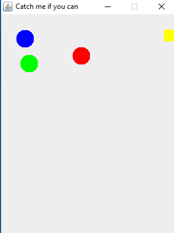

# CSchoolApplications

Codes written for CSchool classes

- SWING: three balls bouncing against each other... 
#

#
  ...and disappearing as they hit the square. 
 # 

- blog output - possbibility to post messages and comments
#

- chart - possibility to enter a and b parameters for drawing x-y line
#

#

- permutations - printing out non-repeating permutations of a given letters combination
#

- Xmas tree printing (with changed pattern)
#

- snail print with empty spaces (snail size and pattern entered by user)
#

